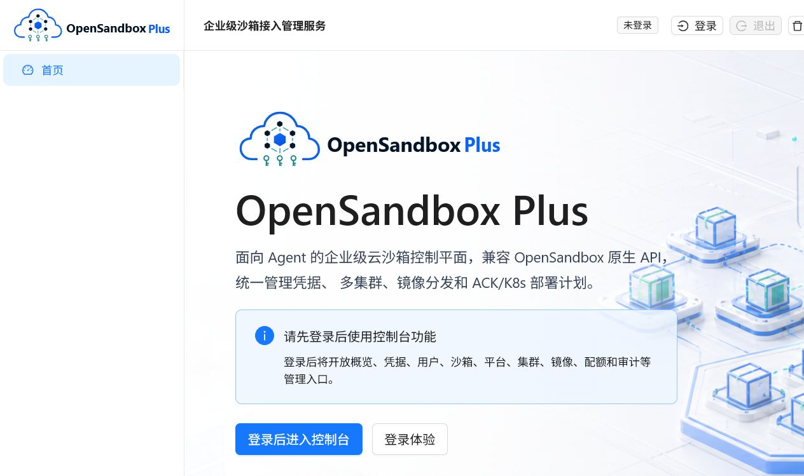

# OpenSandbox Plus

OpenSandbox Plus 是面向 Agent 与企业平台团队的云沙箱接入管理服务。它在保持 OpenSandbox 原生 API 兼容的基础上，补齐企业生产环境通常需要的登录认证、个人云沙箱 key、自助凭据管理、多 OpenSandbox 集群管理、镜像上传与分发、ACK/K8s 接入规划、审计追踪和控制台体验。



## 产品亮点

- **对 Agent 友好**：Agent 用户登录控制台后可申请个人云沙箱 key，后续通过 `OPEN-SANDBOX-API-KEY` 访问 `/v1/sandboxes` 等 OpenSandbox 兼容 API。
- **兼容 OpenSandbox 原生 API**：对外 API 尽量保持 OpenSandbox 路径和语义稳定，只把原本整个 server 一个 key 的模式升级为用户级凭据。
- **企业级管理面**：平台管理员可查看用户、凭据、沙箱、配额、平台状态、审计事件、OpenSandbox 集群、ACK/K8s 接入记录和镜像分发状态。
- **多集群与镜像治理演进**：已具备多 OpenSandbox 集群、镜像目录、镜像分发计划和 ACK 部署记录的数据模型与管理 API，后续可接入真实 ACK/K8s 与镜像仓库。
- **安全与可追踪**：key 仅保存哈希，支持禁用、轮换、过期校验；API 返回统一错误码；请求日志结构化输出并贯穿 `request_id`。
- **单服务交付，保留扩展空间**：当前 Console、API、后台任务合并为一个服务，先用 docker-compose 快速交付，未来可按容量和隔离要求演进到分布式服务。

## 快速上手

### 环境要求

- Docker Desktop 或兼容 Docker Engine
- Docker Compose v2
- Node.js 仅在本地前端开发时需要；普通体验可直接使用容器内构建
- Python 3.12 仅在本地运行后端测试时需要

### 一键启动本地体验环境

```powershell
docker compose -f deploy\docker-compose.yml up -d --build
```

启动后访问：

- Console: `http://localhost:8080/`
- Casdoor: `http://localhost:8000/`
- Health: `http://localhost:8080/health`
- OpenAPI: `http://localhost:8080/openapi.json`
- Swagger UI: `http://localhost:8080/docs`

本地 docker-compose 会启动：

- `opensandbox-plus`：控制面 API + Console 静态资源 + 后台任务
- `opensandbox`：本地 OpenSandbox server
- `postgres`：控制面数据库
- `redis`：后台任务与状态缓存预留
- `casdoor`：本地 OIDC 登录与演示账号

### 本地验收脚本

```powershell
# 只校验 docker-compose 语法
powershell -ExecutionPolicy Bypass -File deploy\verify-local.ps1 -ConfigOnly

# 启动服务并验证健康检查、Console 静态资源、Casdoor、OpenSandbox 内部连通性
powershell -ExecutionPolicy Bypass -File deploy\verify-local.ps1 -Start -Migrate

# 可选：使用本地 Casdoor seed 用户跑 Agent key -> 兼容 API -> 管理员禁用 key 流程
powershell -ExecutionPolicy Bypass -File deploy\verify-local.ps1 -RunBusinessFlow -UseDemoTokens
```

`opensandbox-plus` 容器默认会等待 PostgreSQL 就绪并执行 Alembic 迁移。需要关闭启动迁移时，可设置：

```powershell
OSB_PLUS_RUN_MIGRATIONS=false
```

### 登录与云沙箱 key

Console 使用 Casdoor OIDC Authorization Code + PKCE 登录。本地 compose 会挂载 `deploy/casdoor/init_data.json`，初始化 `osb-console` 应用以及本地演示用户。

登录后：

1. Agent 用户进入“凭据”页面申请云沙箱 key。
2. 后续调用兼容 API 时带上 `OPEN-SANDBOX-API-KEY`。
3. 平台管理员可在用户、审计、集群、镜像、配额等页面进行运营管理。

兼容 API 示例：

```powershell
$headers = @{ "OPEN-SANDBOX-API-KEY" = "<cloud-sandbox-key>" }
Invoke-RestMethod -Method Get -Uri http://localhost:8080/v1/sandboxes -Headers $headers
```

### 本地开发与验证

后端测试：

```powershell
python -m pytest server\tests
python -m ruff check server
```

前端构建：

```powershell
cd console
npm install
npm run build
```

Compose 配置校验：

```powershell
docker compose -f deploy\docker-compose.yml config
```

## 部署与配置

当前推荐以 docker-compose 进行试运行和演示部署。生产化配置请重点替换以下默认值：

- `OSB_PLUS_PUBLIC_BASE_URL`
- `OSB_PLUS_CASDOOR_ISSUER`
- `OSB_PLUS_CREDENTIAL_SECRET_PEPPER`
- `OSB_PLUS_OPENSANDBOX_INTERNAL_API_KEY`
- `OSB_PLUS_CASDOOR_ADMIN_CLIENT_SECRET`
- PostgreSQL、Redis、Casdoor、OpenSandbox、镜像仓库相关地址和密钥

当 `OSB_PLUS_DEPLOYMENT_ENV=production` 时，服务会拒绝弱默认配置，例如非 HTTPS public URL、弱 credential pepper、弱 OpenSandbox internal key 等。

示例环境变量见：

- `deploy/env.example`
- `deploy/docker-compose.yml`
- `deploy/casdoor/README.md`

## 项目结构

```text
server/    FastAPI 后端、SQLAlchemy 模型、Alembic 迁移、管理 API、兼容 API
console/   React + Vite Console
deploy/    Dockerfile、docker-compose、本地验证和 Casdoor 初始化
docs/      技术方案、路线图、API 契约、实施记录和交付验收文档
assets/    品牌与视觉资产
```

## 文档索引

- 企业级生产就绪路线：`docs/企业级生产就绪演进路线.md`
- 下一阶段实施记录：`docs/下一阶段实施记录.md`
- 技术方案：`docs/技术方案.md`
- API 错误码与 OpenAPI 契约：`docs/API错误码与OpenAPI.md`
- MVP API 契约与数据库 DDL：`docs/MVP API契约与数据库DDL.md`
- MVP 交付验收记录：`docs/MVP交付验收记录.md`
- Casdoor 本地配置：`deploy/casdoor/README.md`

## 当前边界

- ACK/K8s 接入目前以部署记录、预检信息和 manifest 计划生成为主，暂不直接调用阿里云 ACK OpenAPI。
- 镜像上传目前保存本地制品并生成分发计划，暂不真实推送到远端镜像仓库。
- OpenSandbox 套件部署目前生成计划，不自动执行 Helm/Kustomize/manifest apply。
- 可观测性已具备结构化日志和 request_id 透传，Prometheus metrics、Trace 和告警仍在后续阶段推进。

## 参与贡献

欢迎围绕以下方向参与：

- OpenSandbox 兼容 API 与 Agent SDK 接入样例
- 多 OpenSandbox 集群调度策略
- ACK/K8s 预检与部署模板
- 镜像仓库分发、重试和回滚流程
- Console 运营体验、审计详情、危险操作确认
- 生产配置、运行手册、安全基线和 CI/CD

建议贡献流程：

1. Fork 仓库并创建功能分支。
2. 提交前运行后端测试、lint、前端构建和 compose config。
3. 在 PR 中说明变更动机、验证结果、兼容性影响和后续风险。
4. 涉及 API、配置、部署或安全行为时，同步更新 `docs/` 下相关文档。

## 开源协议

本项目使用 Apache License 2.0，详见 `LICENSE`。
