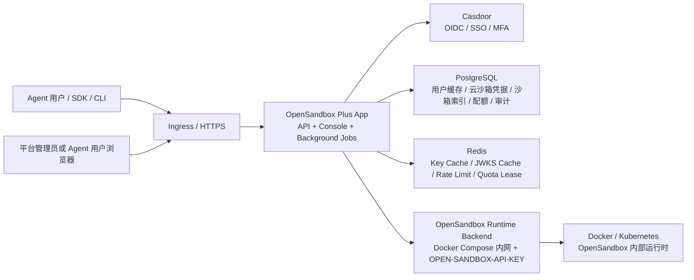
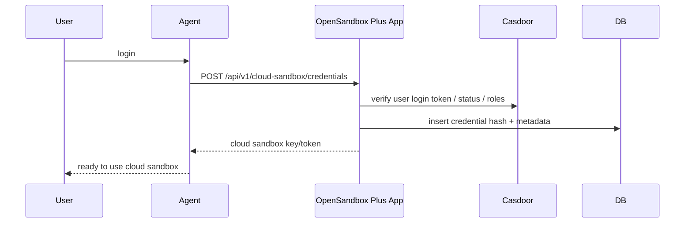
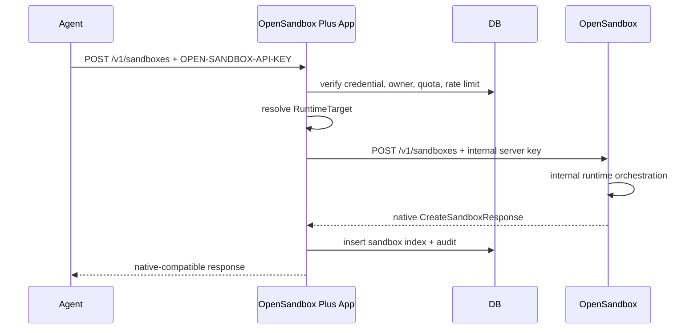
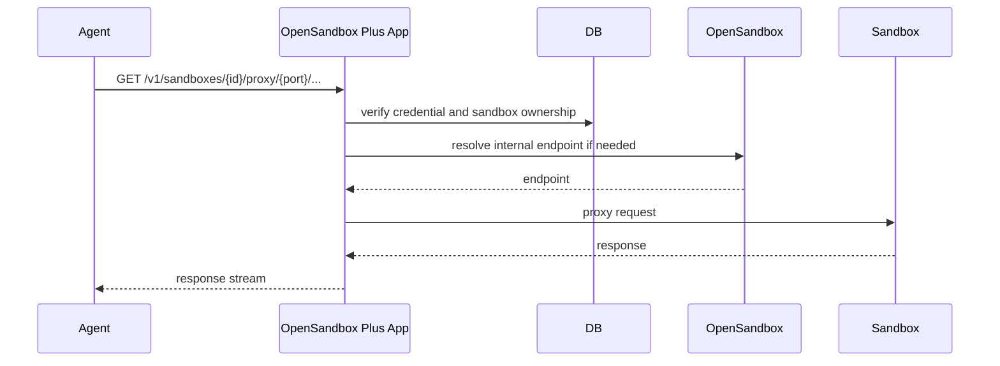

# OpenSandbox Plus 技术方案

调研/设计日期：2026-06-23

## 1. 方案结论

OpenSandbox Plus 的定位是托管化 OpenSandbox 服务层，而不是改造 OpenSandbox 本体。

采用：

- OpenSandbox：只作为内网沙箱运行时和生命周期控制服务。
- 自研 OpenSandbox Plus App：一个服务同时提供 OpenSandbox 兼容 API、管理 API、Console 静态资源和轻量后台任务，负责云沙箱凭据 key/token 认证、资源归属、配额、审计、OpenSandbox adapter 和多 backend 调度。
- Casdoor：作为 IAM/SSO 中心，负责用户登录、平台管理员身份、OIDC/OAuth2、MFA 和基础用户目录。

核心原则：

- 对 Agent 开放的沙箱 API 与 OpenSandbox 原生 API 完全兼容。
- Agent 侧仍使用 `OPEN-SANDBOX-API-KEY` 请求头；变化只是 key 从 OpenSandbox Server 级共享 key，变成用户登录 Agent 后由 Agent 通过 API 申请颁发的云沙箱凭据 key/token。
- 不把 OpenSandbox Server 直接暴露给最终用户、浏览器、SDK 或 Agent 平台。
- 不让浏览器、用户 SDK 或 Agent 持有 OpenSandbox 内部服务 key。
- 不引入“租户管理员”作为核心角色；核心角色只有平台管理员和想使用云沙箱的 Agent 用户。
- 不在 OpenSandbox Plus App 层建模 Kubernetes/Docker 的运行时内部对象。
- 不在 OpenSandbox Plus App 里重造完整 IAM，只保留托管云沙箱控制面必须的数据。

### 1.1 产品目标

建设一个 Managed OpenSandbox 服务层：在 OpenSandbox Server 之上增加一个统一 OpenSandbox Plus App，为 2 万+ Agent 用户提供安全、可治理、秒级启动的云沙箱能力，并支持管理、监控、调度一个或多个 OpenSandbox Server。MVP 阶段先提供管理面当前状态查询，完整可观测体系后续建设。

目标不是替代 OpenSandbox Server，也不是在 OpenSandbox Plus App 里实现 Kubernetes 管理平台；目标是在 OpenSandbox 之上补齐服务入口、云沙箱凭据颁发、资源归属、配额治理、流量调度、管理面状态和平台管理后台。

### 1.2 核心用户角色

| 角色 | 核心诉求 |
| --- | --- |
| 平台管理员 | 管理全局配置、OpenSandbox backend、runtime profile、镜像策略、用户配额、凭据颁发策略、审计与告警 |
| Agent 用户 | 登录 Agent 后，由 Agent 通过 API 申请颁发云沙箱凭据 key/token，后续用该凭据调用 OpenSandbox 原生 SDK/API 创建沙箱、访问 endpoint、执行任务、续期、暂停、恢复或销毁沙箱 |

说明：

- SRE、安全审计、运营等岗位能力纳入“平台管理员”的权限范围，可在 Console 内用平台管理员的岗位权限细分实现，但不作为核心产品角色。
- 不提供“租户管理员”角色。用户、配额、runtime profile、镜像策略和 backend 可由平台管理员统一配置；Agent 用户只管理自己的 key 和自己的沙箱。
- 如后续需要团队、客户、部门等分组，只作为平台管理员维护的资源标签或账号域策略，不引入新的管理员角色。

### 1.3 核心业务需求

| 编号 | 需求 | 说明 |
| --- | --- | --- |
| R1 | 统一入口 | 所有 SDK、CLI、Agent 平台和 Console 只访问 OpenSandbox Plus App，不直接访问 OpenSandbox Server |
| R2 | 原生 API 兼容 | OpenSandbox Plus App 对 Agent 暴露 OpenSandbox 原生 lifecycle、diagnostic、endpoint/proxy API 路径、方法、请求体和响应体 |
| R3 | 云沙箱凭据颁发 | 用户登录 Agent 后，Agent 调用 OpenSandbox Plus App 凭据颁发 API 获取云沙箱 key/token；平台管理员可审计和强制吊销 |
| R4 | 业务授权 | OpenSandbox Plus App 根据凭据 key/token 解析用户身份，只允许 Agent 用户访问自己创建或被平台授权的沙箱 |
| R5 | 沙箱生命周期 | 支持创建、查询、列表、续期、暂停、恢复、删除、自动过期回收和状态对账 |
| R6 | 多 OpenSandbox backend 管理 | 平台管理员可注册、启用、禁用、查看一个或多个 OpenSandbox Server；OpenSandbox Plus App 只建模 runtime backend 抽象 |
| R7 | 流量调度与负载均衡 | OpenSandbox Plus App 按 backend 健康、权重、runtime profile、区域、当前负载和用户策略选择 OpenSandbox backend |
| R8 | 秒级启动体验 | 对 Agent 暴露秒级创建体验目标；OpenSandbox Plus App 避开拥塞 backend，OpenSandbox Server 负责底层热池、镜像预拉取和运行时调度 |
| R9 | 配额与限流 | 支持按用户、凭据 key/token、runtime profile、镜像策略、全局 backend 水位限制并发沙箱数、创建速率和 TTL |
| R10 | 管理后台 | 提供平台管理员页面和 Agent 用户查看页面，覆盖凭据、沙箱、backend、runtime profile、镜像策略、审计日志和容量看板 |
| R11 | 安全合规 | OpenSandbox 内部 API Key 只保存在 OpenSandbox Plus App；所有管理和生命周期操作写审计；日志脱敏敏感凭据 |

### 1.4 Agent API 兼容性要求

这是本方案最重要的兼容边界。

Agent 访问 OpenSandbox Plus App 时，应像访问 OpenSandbox Server 一样调用：

```http
OPEN-SANDBOX-API-KEY: <cloud-sandbox-credential-key>
```

OpenSandbox Plus App 对外必须兼容 OpenSandbox 原生 API：

| OpenSandbox 原生能力 | OpenSandbox Plus App 对 Agent 的要求 |
| --- | --- |
| `POST /v1/sandboxes`、`POST /sandboxes` | 路径、方法、请求体、状态码、响应体兼容 |
| `GET /v1/sandboxes`、`GET /sandboxes` | 查询参数和响应模型兼容，但列表只返回当前 key 有权访问的沙箱 |
| `GET /v1/sandboxes/{sandboxId}` | 响应模型兼容，先做用户归属检查 |
| `PATCH /v1/sandboxes/{sandboxId}/metadata` | 请求体和响应体兼容，限制只能修改有权访问的沙箱 |
| `DELETE /v1/sandboxes/{sandboxId}` | 状态码兼容，限制只能删除有权访问的沙箱 |
| `POST /v1/sandboxes/{sandboxId}/pause` | 与原生 API 兼容，限制只能操作有权访问的沙箱 |
| `POST /v1/sandboxes/{sandboxId}/resume` | 与原生 API 兼容，限制只能操作有权访问的沙箱 |
| `POST /v1/sandboxes/{sandboxId}/renew-expiration` | 与原生 API 兼容，并叠加用户 TTL 配额 |
| `GET /v1/sandboxes/{sandboxId}/endpoints/{port}` | 响应模型兼容，先做 `sandbox:connect` 授权 |
| `ANY /v1/sandboxes/{sandboxId}/proxy/{port}/...` | 路径兼容，但由 OpenSandbox Plus App 先认证授权，再代理到内部 endpoint |
| `GET /v1/sandboxes/{sandboxId}/diagnostics/logs` | 与 diagnostic API 兼容，先做归属检查 |
| `GET /v1/sandboxes/{sandboxId}/diagnostics/events` | 与 diagnostic API 兼容，先做归属检查 |

兼容原则：

- 现有 OpenSandbox SDK 只需要把 base URL 指向 OpenSandbox Plus App，并把 SDK 的 `api_key` 参数设置为 Agent 通过凭据颁发 API 获取的云沙箱 key/token。
- Agent 沙箱 API 不要求改用 `Authorization: Bearer`，避免破坏原生 SDK。
- OpenSandbox Plus App 管理 API、Console API、凭据颁发 API 另走 `/api/v1/...` 命名空间，不能污染 OpenSandbox 原生 API 命名空间。
- OpenSandbox Plus App 不应在用户可见的请求体或响应体里加入破坏兼容的字段；内部归属、backend、key id、审计信息放在控制面 DB。
- 如果 OpenSandbox Plus App 需要追踪链路，优先使用 `X-Request-ID`、审计表和沙箱索引表，不依赖向用户 metadata 注入内部字段。

### 1.5 容量与体验目标

2 万+ Agent 用户不是直接等价于 2 万+ 同时运行的沙箱。容量设计和验收应以这些指标为准：

| 指标 | 说明 |
| --- | --- |
| 注册 Agent 用户数 | 平台可承载的长期身份、云沙箱凭据、权限与审计规模 |
| 有效凭据数 | key/token 校验、轮换、撤销、审计和缓存规模 |
| 并发运行沙箱数 | 真正决定 runtime backend 和底层资源容量的核心指标 |
| 创建/销毁速率 | 决定 OpenSandbox backend 扩容、预热和限流策略 |
| 沙箱启动耗时 | Agent 用户感知的核心体验，需按 P50/P95/P99 监控 |
| endpoint 并发连接数 | 决定 OpenSandbox Plus App proxy、反向代理、连接池和限流策略 |
| 单用户水位 | 防止单个 Agent 用户或单个 key 打满全局容量 |

建议把“秒级启动”定义为可度量目标：

- OpenSandbox Plus App 控制面鉴权、配额校验、backend 选择的 P95 延迟控制在 100ms 量级。
- 热路径沙箱创建到可访问 endpoint 的 P95 目标为数秒级，具体数值由 OpenSandbox backend 的镜像、热池和资源规格共同决定。
- 当 backend 负载过高时，OpenSandbox Plus App 快速返回限流、排队或不可用状态，不把请求继续打到拥塞 backend。

### 1.6 MVP 范围

MVP 必做：

- Casdoor OIDC 登录，用于 Console。
- 平台管理员和 Agent 用户两类核心角色。
- 用户登录 Agent 后的云沙箱凭据颁发 API。
- OpenSandbox Plus App 兼容 OpenSandbox 原生 lifecycle API 的 create/list/get/delete/renew/pause/resume/endpoint。
- 一个 OpenSandbox runtime backend 注册、健康检查和启停用。
- 用户级沙箱归属索引、权限过滤和审计日志。
- 用户、凭据 key/token、TTL、创建速率、并发运行沙箱数配额。
- Console 基础页面：平台管理、用户凭据、用户沙箱列表。
- 结构化日志、审计日志、管理面平台状态查询接口。

MVP 不做：

- 不引入租户管理员、项目管理员或团队管理员角色。
- 不在 OpenSandbox Plus App 管理底层运行时对象、资源池或调度细节。
- 不在 OpenSandbox Plus App 实现底层沙箱热池、镜像预拉取或运行时调度。
- 不把 OpenSandbox Server 改造成完整 IAM 或多租户系统。
- 不直接暴露 OpenSandbox Server 给用户、浏览器、SDK 或 Agent 平台。
- 不改变 OpenSandbox SDK 的调用模型。

## 2. 背景约束

### 2.1 OpenSandbox 当前形态

参考 `opensandbox-temp` 当前代码和文档：

- 服务 API Key 由 `server/opensandbox_server/config.py` 的 `server.api_key` 配置。
- 中间件 `server/opensandbox_server/middleware/auth.py` 读取请求头 `OPEN-SANDBOX-API-KEY`。
- 原生生命周期 API 位于 `server/opensandbox_server/api/lifecycle.py`，核心接口包括 `/sandboxes`、`/v1/sandboxes`。
- proxy API 位于 `server/opensandbox_server/api/proxy.py`，如 `/sandboxes/{sandbox_id}/proxy/{port}`。
- OpenSandbox 文档 `docs/api/index.md` 明确 lifecycle 和 diagnostic API 均使用 `OPEN-SANDBOX-API-KEY`。
- Python SDK 在 `sdks/sandbox/python/src/opensandbox/adapters/sandboxes_adapter.py` 中把 `api_key` 写入 `OPEN-SANDBOX-API-KEY` 请求头。
- auth middleware 对 proxy path 有特殊跳过逻辑，因此不能把 OpenSandbox Server 的 proxy route 直接暴露给最终用户。

结论：OpenSandbox Server 应放在内网，只允许 OpenSandbox Plus App 调用。OpenSandbox Plus App 对外复刻 OpenSandbox API，但认证和归属检查由 OpenSandbox Plus App 完成。

### 2.2 Casdoor 能力边界

Casdoor 可提供：

- 标准 OIDC discovery：`/.well-known/openid-configuration`。
- JWKS：用于 OpenSandbox Plus App 验证 Console 登录态 JWT。
- OAuth2 Authorization Code + PKCE：适合 Console。
- Public API：用于平台侧用户目录、角色、禁用状态同步。
- User、Application、Role、Permission、MFA、第三方登录等 IAM 能力。

Casdoor 不负责：

- 保存沙箱生命周期状态。
- 决定沙箱归属。
- 保存云沙箱凭据 key/token 明文。
- 承载 OpenSandbox 运行时调度状态。

结论：Casdoor 做 IAM；沙箱资源归属、云沙箱凭据 key/token、配额、生命周期审计在 OpenSandbox Plus 控制面落库。

## 3. 总体架构



### 3.1 组件职责

| 组件 | 职责 | 不做什么 |
| --- | --- | --- |
| OpenSandbox Plus App | OpenSandbox 兼容 API、管理 API、Console 静态资源、轻量后台任务、云沙箱凭据校验、归属检查、配额、审计、OpenSandbox adapter、多 backend 调度 | 不保存用户密码，不建模底层 runtime 对象 |
| Casdoor | 登录、用户目录、平台管理员身份、OIDC、MFA、基础角色 | 不保存 sandbox 生命周期状态，不保存云沙箱凭据明文 |
| OpenSandbox | 创建、销毁、续期、暂停、恢复沙箱，解析 endpoint，处理运行时调度细节 | 不面向终端用户做用户级 key、RBAC 或审计 |
| PostgreSQL | OpenSandbox Plus 控制面数据 | 不存 Casdoor 密码或 OpenSandbox 内部 key 明文 |
| Redis | 短缓存、限流、配额租约 | 不作为唯一状态源 |
| Docker / Kubernetes | OpenSandbox 内部运行时；MVP 部署层先用 Docker Compose | 不暴露给 OpenSandbox Plus App 作为业务对象 |

## 4. 部署拓扑

### 4.1 域名建议

| 域名 | 指向 |
| --- | --- |
| `sandbox.example.com` | OpenSandbox Plus App，同时承载 Console、OpenSandbox 兼容 API 和管理 API |
| `api.example.com` | 可选别名，指向同一个 OpenSandbox Plus App，便于 SDK 配置 |
| `auth.example.com` | Casdoor |
| `osb-internal.example.svc` | OpenSandbox 内网服务，不暴露公网 |

### 4.2 网络边界

- 公网只暴露 OpenSandbox Plus App 和 Casdoor。
- OpenSandbox Server 只允许 OpenSandbox Plus App 服务身份或受控网络来源访问。
- Agent 入站 key 使用 `OPEN-SANDBOX-API-KEY: <cloud-sandbox-credential-key>`。
- OpenSandbox Plus App 调 OpenSandbox 时替换成内部 `OPEN-SANDBOX-API-KEY: <internal-service-key>`。
- OpenSandbox Plus App 必须剥离外部传入的内部头，例如 `X-Internal-*`、`X-Forwarded-User`、伪造的 backend 路由头。
- OpenSandbox Plus App 不能把 Agent 用户的云沙箱凭据转发给 OpenSandbox Server。
- MVP 使用 docker-compose 内部网络隔离 OpenSandbox；后续升级 Kubernetes 时再引入 NetworkPolicy 和最小权限 service account。

### 4.3 MVP docker-compose 拓扑

MVP 先使用 docker-compose 部署，降低初期环境复杂度。自研部分只保留一个 `opensandbox-plus` 服务：

| 服务 | 说明 |
| --- | --- |
| `opensandbox-plus` | 单个自研服务：FastAPI API、管理 API、Console 静态文件、轻量后台任务 |
| `casdoor` | IAM/SSO 服务 |
| `postgres` | OpenSandbox Plus 控制面数据库 |
| `redis` | 缓存、限流、quota lease |
| `opensandbox` | OpenSandbox Server，只加入内部网络，不直接对公网开放 |

网络建议：

- `public` 网络：只给 `opensandbox-plus`、`casdoor` 暴露入口。
- `internal` 网络：`opensandbox-plus`、`postgres`、`redis`、`opensandbox` 内部互通。
- `opensandbox` 不映射公网端口；本地调试如需映射端口，必须仅绑定 `127.0.0.1`。

配置建议：

- MVP 可使用 `.env` 注入数据库、Redis、Casdoor、OpenSandbox 内部 key 和 app 启动模式。
- `.env` 不提交 Git。
- 生产化 docker-compose 可改为 Docker secret、Vault/KMS 或云 Secret Manager。
- 后续升级 Kubernetes 时，可用同一镜像按 `APP_ROLE=api|worker|all` 拆分为多个 Deployment。

## 5. 技术选型

### 5.1 总体选型结论

MVP 选型以“尽快交付、兼容 OpenSandbox、降低团队学习成本、便于后续横向扩展”为优先级。

架构简化原则：

- MVP 自研部署单元只有一个 `opensandbox-plus` 服务，不拆独立 API 服务、worker 服务、Console 服务或静态资源服务。
- Console 由前端构建成静态资源，直接打包进 `opensandbox-plus` 镜像，由 FastAPI/Starlette 托管。
- 后台任务先以内置轻量 scheduler 运行在同一服务进程内，通过 PostgreSQL advisory lock 保证后续多副本或拆 worker 时不会重复执行。
- 代码内部仍按 API、Console 静态资源、jobs、adapter、repository 等模块分层，保留未来用同一镜像按 `APP_ROLE=api|worker|all` 拆分部署的能力。

| 层级 | 选型 | 说明 |
| --- | --- | --- |
| App 开发语言 | Python 3.12+ | 与 OpenSandbox Server 技术栈一致，便于复用模型、测试和运维经验 |
| App Web 框架 | FastAPI | 一个服务同时承载 OpenSandbox 兼容 API、管理 API、Console 静态资源和后台任务 |
| ASGI Runtime | Uvicorn | MVP 单进程运行，docker-compose 下先单副本 |
| 数据校验/配置 | Pydantic v2 + pydantic-settings | 请求模型、配置模型、环境变量和 Secret 引用统一建模 |
| 数据库 | PostgreSQL 16+ | 作为 OpenSandbox Plus 控制面唯一强一致状态源 |
| ORM / Migration | SQLAlchemy 2.x + Alembic | 兼顾开发效率、事务控制和 schema migration |
| PostgreSQL Driver | asyncpg | 配合 FastAPI async path 使用 |
| 缓存/限流/租约 | Redis 7+ | 存 key 校验缓存、JWKS/principal 缓存、限流计数和 quota lease |
| OpenSandbox 调用 | httpx + OpenAPI generated client 可选 | 生命周期 API 用 typed client，proxy/兼容透传路径用 httpx 更直接 |
| Console 开发语言 | TypeScript | 降低管理后台复杂状态和 API 类型错误 |
| Console 框架 | React + Vite | 构建为静态资源，打包进 OpenSandbox Plus App 镜像 |
| Console UI | Ant Design + ECharts | 后台管理、表格、表单、筛选、图表能力成熟 |
| Console 数据请求 | TanStack Query | 统一缓存、重试、失效、分页和后台刷新 |
| Console 路由 | React Router | 适合 Console SPA 路由、权限布局和详情页 |
| Console OIDC | oidc-client-ts | 对接 Casdoor Authorization Code + PKCE |
| 部署 | Docker + docker-compose | MVP 先降低部署复杂度，后续再升级 Kubernetes + Helm |
| 平台状态 | OpenSandbox Plus 管理面状态 API | 暂不建设完整可观测体系，管理面按需获取当前最新平台状态 |
| 测试 | pytest / Vitest / Playwright | 后端单元与集成测试、前端组件测试、端到端兼容性测试 |

### 5.2 OpenSandbox Plus App 后端技术栈

推荐选择 Python + FastAPI，而不是 Go 作为 MVP 首选。

理由：

- OpenSandbox Server 当前是 Python/FastAPI 生态，OpenSandbox Plus App 需要大量对齐 OpenSandbox API、schema、错误模型和 SDK 行为，Python 集成成本最低。
- 核心瓶颈预计在 OpenSandbox runtime 创建速率、backend 水位和 endpoint 长连接，不在普通 HTTP 控制面的语言性能。
- FastAPI 对 OpenAPI、请求模型和异步 IO 支持成熟，适合实现“原生 API 兼容 + 私有管理 API”两套命名空间。
- Python 生态中 httpx、websockets、SQLAlchemy、Alembic、pytest 等工具链完整，便于快速做 adapter、reconciler、静态资源托管和兼容性测试。

后端组件建议：

| 能力 | 技术 |
| --- | --- |
| API framework | FastAPI |
| ASGI server | Uvicorn |
| HTTP client | httpx |
| WebSocket proxy | Starlette/FastAPI WebSocket + websockets/httpx stream |
| Data model | Pydantic v2 |
| Config | pydantic-settings |
| DB access | SQLAlchemy 2.x async + asyncpg |
| Migration | Alembic |
| Auth/JWT | PyJWT 或 Authlib，按 Casdoor OIDC/JWKS 校验需求选一个 |
| Credential hash | 高熵随机凭据使用 HMAC-SHA256 + KMS/Secret pepper；无需使用慢密码哈希 |
| Background jobs | MVP 用同一 FastAPI 进程内的轻量 scheduler + PostgreSQL advisory lock；未来可按 `APP_ROLE=worker` 拆出 |
| Platform status | OpenSandbox Plus admin status service |
| Logging | structlog 或标准 logging + JSON formatter |

实现约束：

- OpenSandbox 原生命名空间下，尽量透明转发请求体和响应体，避免 Pydantic 模型序列化破坏兼容性。
- 管理 API 可以使用强类型 Pydantic schema。
- Console 由 Vite 构建为静态文件，MVP 通过 FastAPI/Starlette StaticFiles 直接托管。
- 后台任务和 API 同进程运行，但所有任务必须拿 PostgreSQL advisory lock，避免未来多副本时重复执行。
- MVP 不引入 Celery、RQ、Temporal 等独立任务系统；确实出现长耗时或高频任务后，再按 `APP_ROLE=worker` 拆出同镜像 worker。
- 预留 `APP_ROLE=all|api|worker`：MVP 用 `all`，后续可用同一镜像拆成 API 和 worker。
- Adapter 层对生命周期 API 可使用 OpenAPI generated client；对 proxy、stream、WebSocket 等兼容路径优先使用 httpx/stream 直接转发。
- 所有数据库写操作必须显式事务化；凭据颁发、sandbox 索引写入和 audit 写入要考虑失败补偿。

Go 保留为后续选项：

- 如果压测证明 OpenSandbox Plus App 的 CPU、内存或 P99 延迟成为瓶颈，可把高频鉴权、endpoint proxy 或限流服务独立为 Go 服务。
- 不建议 MVP 同时维护 Python App + Go App，避免兼容性和测试成本翻倍。

### 5.3 Console 前端技术栈

Console 是登录后的运维/管理型 SPA，不需要服务端渲染或 SEO，因此选择 React + Vite，并把构建产物合并进 OpenSandbox Plus App 镜像。

推荐组件：

| 能力 | 技术 |
| --- | --- |
| Framework | React + TypeScript |
| Build tool | Vite |
| UI component | Ant Design |
| Data fetching | TanStack Query |
| Routing | React Router |
| Forms | Ant Design Form；复杂表单可引入 React Hook Form + Zod |
| Charts | ECharts |
| OIDC client | oidc-client-ts |
| Unit/component test | Vitest + Testing Library |
| E2E | Playwright |

设计取向：

- Console 是工作台，不做营销型 landing page。
- 优先表格、筛选、详情抽屉、状态标签、审计时间线、容量图表。
- 平台管理员页面和 Agent 用户页面共用布局，但菜单和权限由 OpenSandbox Plus App 返回的角色/功能开关控制。
- 前端只做展示控制；所有权限判断必须由 OpenSandbox Plus App 服务端执行。
- MVP 不单独部署 nginx 或 Console 服务；需要 CDN、独立静态资源服务或多域名时再拆。

不选择 Next.js：

- 当前 Console 没有 SSR、SEO、边缘渲染需求。
- Vite SPA 更轻，部署成静态资源即可，复杂度低。

### 5.4 数据库、缓存与存储

PostgreSQL 是 OpenSandbox Plus 控制面唯一强一致状态源。

适合放 PostgreSQL 的数据：

- 用户身份缓存。
- 云沙箱凭据 metadata 和 hash。
- sandbox 索引和状态。
- runtime backend/profile。
- quota rule 和确认后的用量。
- audit event。
- sandbox event。

PostgreSQL 使用建议：

- 生产使用托管 PostgreSQL 或高可用集群。
- 审计表按时间分区，避免长期数据拖慢在线查询。
- sandbox、credential、audit 核心查询字段必须建索引。
- JSONB 只存扩展 metadata，不把核心查询条件长期藏在 JSONB 里。

Redis 只做短生命周期状态，不做唯一事实源：

- 凭据校验缓存。
- JWKS/principal 缓存。
- rate limit counter。
- quota lease。
- backend health 短缓存。

不选择 MySQL/MongoDB 作为主库：

- OpenSandbox Plus 控制面需要事务、唯一约束、部分索引、JSONB、审计分区和复杂过滤，PostgreSQL 更合适。
- MongoDB 不适合作为这类强一致控制面主状态源。

### 5.5 基础设施与运维组件

| 能力 | 选型 |
| --- | --- |
| Container | Docker |
| Orchestration | MVP 使用 docker-compose；后续升级 Kubernetes |
| Packaging | docker-compose.yml；后续补 Helm chart |
| Ingress | MVP 用 nginx/Caddy/Traefik 或云负载均衡反代到 compose 服务 |
| Secret | MVP 用 `.env` 或 Docker secret；生产接 Vault/KMS/云 Secret Manager |
| Platform Status | OpenSandbox Plus 管理面 API 实时汇总 |
| Observability | MVP 暂不建设 Prometheus/Grafana/Loki/Tracing |
| CI | GitHub Actions 或现有 CI |
| Image registry | 企业镜像仓库 |

部署形态：

- `opensandbox-plus`、Casdoor、PostgreSQL、Redis、OpenSandbox 作为 docker-compose 独立 service。
- `opensandbox-plus` 一个服务同时提供 API、Console 静态资源和轻量后台任务。
- MVP 先单副本运行；后台任务使用 PostgreSQL advisory lock，为未来多副本或独立 worker 做准备。
- 升级 Kubernetes 时，`opensandbox-plus` 可先作为单 Deployment 运行；规模上来后再用同一镜像按 `APP_ROLE=api|worker` 拆成多个 Deployment。

### 5.6 测试与质量

后端测试：

- pytest + pytest-asyncio。
- respx/mock httpx 测 OpenSandbox adapter。
- Testcontainers 或 docker compose 跑 PostgreSQL/Redis 集成测试。
- OpenSandbox 原生 OpenAPI/SDK 兼容性测试：同一组 SDK 调用分别打 OpenSandbox Server 和 OpenSandbox Plus App，校验关键响应字段、状态码和错误模型。

前端测试：

- Vitest + Testing Library 覆盖组件和权限渲染。
- Playwright 覆盖登录、凭据查看、沙箱列表、管理员后台关键路径。

质量门禁：

- Python：ruff、mypy/pyright、pytest。
- TypeScript：eslint、typecheck、vitest。
- API：OpenAPI diff 或契约测试，防止破坏 OpenSandbox 原生兼容性。
- 安全：依赖扫描、镜像扫描、secret scanning。

### 5.7 单服务工程结构与开发边界

MVP 采用“单体部署、模块化代码”的工程形态：运行时只有一个 `opensandbox-plus` 服务，但代码内部保持清晰模块边界，避免未来拆分 worker、API 或独立 Console 时返工。

推荐目录结构：

```text
opensandbox-plus/
  server/
    pyproject.toml
    alembic/
    opensandbox_plus/
      main.py
      config.py
      api/
        native/          # OpenSandbox 原生命名空间兼容 API
        management/      # /api/v1 Console 和管理 API
        health.py
      auth/              # Casdoor OIDC、Console 会话、云沙箱凭据校验
      credentials/       # 凭据颁发、轮换、禁用、hash
      sandboxes/         # 沙箱索引、归属、状态机、配额入口
      adapter/           # OpenSandbox backend client、proxy、WebSocket stream
      backends/          # backend 健康、选择策略、runtime profile
      jobs/              # reconciler、backend health、过期清理
      db/                # SQLAlchemy session、models、repositories
      audit/             # 审计事件写入和脱敏
      static/            # Console 构建产物挂载目录
  console/
    package.json
    src/
  deploy/
    docker-compose.yml
    Dockerfile
    env.example
  tests/
```

单服务启动模式：

| `APP_ROLE` | 用途 | MVP 行为 |
| --- | --- | --- |
| `all` | API + Console + jobs | 默认值，docker-compose 只启动这一种 |
| `api` | API + Console，不跑后台任务 | 为未来多副本或 K8s 拆分预留 |
| `worker` | 只跑后台任务和内部健康检查 | 为未来独立 worker 预留 |

模块调用边界：

1. `api/native` 保持 OpenSandbox 路径、方法、请求体和响应体兼容，只做认证、授权、配额、归属和 adapter 调用编排。
2. `api/management` 只服务 Console 和平台管理场景，所有接口放在 `/api/v1/...`。
3. `adapter` 负责调用内部 OpenSandbox Server，外部用户 key/token 不能穿透到 adapter 出站请求。
4. `sandboxes` 只维护 OpenSandbox Plus 的业务索引和状态映射，不直接管理 Docker container、Kubernetes Pod 或 CRD。
5. `jobs` 可以和 API 同进程运行，但每个周期任务都必须通过 PostgreSQL advisory lock 控制并发。
6. `console` 构建产物由 Dockerfile 复制到 `server/opensandbox_plus/static/console`，由 FastAPI StaticFiles 托管。

从 `opensandbox-temp` 参考但不直接 fork 的内容：

- 参考 `opensandbox-temp/server/opensandbox_server/api/lifecycle.py`、`api/proxy.py`、`api/schema.py` 的路由形态、响应模型和错误语义。
- 参考 `opensandbox-temp/server/opensandbox_server/middleware/auth.py` 对 `OPEN-SANDBOX-API-KEY` 的 header 约定，但 OpenSandbox Plus 要改为校验用户申请的云沙箱凭据。
- 参考 `opensandbox-temp/server/tests/smoke.sh` 和 `tests/python`、`tests/javascript` 的 SDK/e2e 用例，沉淀为兼容性测试。
- 不修改 `opensandbox-temp` 作为业务控制面；MVP 通过 HTTP adapter 调用内部 OpenSandbox Server，降低后续跟随 upstream 的成本。

MVP 开发顺序：

1. 初始化 Python/FastAPI、React/Vite、docker-compose 和配置加载。
2. 建立 PostgreSQL schema、Alembic migration、SQLAlchemy repository。
3. 接入 Casdoor OIDC，打通 `/api/v1/me`。
4. 实现云沙箱凭据颁发、hash 存储、一次性返回和 `OPEN-SANDBOX-API-KEY` 校验。
5. 实现 OpenSandbox 兼容 `POST/GET/DELETE /v1/sandboxes` 和无 `/v1` 路径。
6. 实现沙箱归属过滤、审计事件和基础 quota。
7. 实现 endpoint/proxy 的最小可用链路。
8. 实现 Console 的登录、凭据列表、沙箱列表、backend 状态页。
9. 补齐兼容性测试、隔离测试和 docker-compose 验收脚本。

## 6. 身份、角色与云沙箱凭据

### 6.1 Casdoor Application

创建这些 Casdoor Applications：

| Application | 类型 | 用途 |
| --- | --- | --- |
| `osb-console` | OIDC SPA/Public Client | Console 登录，Authorization Code + PKCE |
| `osb-plus-admin` | Confidential Client | OpenSandbox Plus App 调 Casdoor Public API 的 M2M 凭据 |

`osb-console` 配置：

- Redirect URI：`https://sandbox.example.com/auth/callback`
- Post logout redirect URI：`https://sandbox.example.com/login`
- Scope：`openid profile email offline_access`
- PKCE：启用 S256

`osb-plus-admin` 配置：

- Client Credentials Grant。
- 仅 OpenSandbox Plus App 使用；MVP secret 通过 `.env` 或 Docker secret 注入，生产可接外部 secret manager。
- 权限限制在读取用户、角色、禁用状态和必要的审计同步 API。

### 6.2 角色模型

Casdoor 只声明核心身份，OpenSandbox Plus App 再做沙箱业务权限细化。

| Role | 说明 |
| --- | --- |
| `osb_platform_admin` | 平台管理员，可管理全局 backend、runtime profile、镜像策略、用户配额、凭据颁发策略和审计 |
| `osb_agent_user` | Agent 用户，登录 Agent 后可由 Agent 申请云沙箱凭据 key/token，并用原生 OpenSandbox API 管理自己的沙箱 |

权限映射：

```text
platform_admin -> platform:* and sandbox:* on all resources
agent_user     -> credential:issue_for_self, credential:revoke_own, sandbox:create, sandbox:read_own, sandbox:manage_own, sandbox:connect_own
```

不设置：

- `tenant_admin`
- `project_admin`
- `developer`
- `viewer`
- `service_account` 作为核心角色

如确有机器到机器集成需求，建议仍归属到某个 Agent 用户或平台创建的受控 Agent 身份，发放同一套云沙箱凭据 key/token，避免新增角色体系。

### 6.3 云沙箱凭据 key/token 策略

凭据颁发流程：

1. 用户登录 Agent。
2. Agent 获得用户登录态，例如 OIDC access token、Agent 平台会话 token 或可信 Agent 签名。
3. Agent 调用 OpenSandbox Plus App 凭据颁发 API，申请云沙箱访问凭据 key/token。
4. OpenSandbox Plus App 校验用户身份、Agent 来源、用户状态、配额和颁发策略。
5. OpenSandbox Plus App 生成云沙箱凭据 secret，只在响应中返回一次。
6. OpenSandbox Plus App 仅保存凭据 hash、prefix、owner、来源 Agent、状态、最近使用时间和策略。
7. Agent 后续把该 key/token 放入 `OPEN-SANDBOX-API-KEY`，调用 OpenSandbox 原生兼容 API。
8. Agent 或平台管理员可通过 API 禁用、删除、轮换凭据。

凭据格式建议：

```text
osb_u_<public_prefix>.<secret_random>
```

存储要求：

- DB 只保存 `key_hash`，使用 Argon2id、bcrypt 或 HMAC-SHA256 + KMS pepper。
- `public_prefix` 用于快速定位，不能作为认证凭据。
- 日志和审计只记录 `credential_id`、`public_prefix`、owner，不记录 secret。
- 凭据可设置过期时间、状态、最近使用时间、最后使用 IP、user agent 和来源 Agent。

### 6.4 入站与出站认证

Agent 到 OpenSandbox Plus App 的 OpenSandbox 兼容 API：

```http
OPEN-SANDBOX-API-KEY: osb_u_xxx.yyy
```

OpenSandbox Plus App 认证后得到 principal：

```json
{
  "subject_id": "casdoor:user:built-in/alice",
  "subject_type": "agent_user",
  "username": "alice",
  "email": "alice@example.com",
  "roles": ["osb_agent_user"],
  "credential_id": "cred_01J...",
  "credential_prefix": "osb_u_xxx",
  "auth_method": "cloud_sandbox_credential"
}
```

OpenSandbox Plus App 到 OpenSandbox：

```http
OPEN-SANDBOX-API-KEY: <internal-service-key>
X-Request-ID: <request_id>
```

Agent 申请云沙箱凭据、Console 调管理 API 时可使用：

```http
Authorization: Bearer <user-or-agent-login-token>
```

说明：

- Bearer token 用于凭据颁发 API、Console 和管理 API。
- OpenSandbox 原生命名空间下的 Agent API 继续使用 `OPEN-SANDBOX-API-KEY`，保持 SDK 兼容。

## 7. OpenSandbox Plus 授权模型

### 7.1 动作定义

```text
credential:issue_for_self
credential:list_own
credential:delete_own
credential:rotate_own
credential:revoke_any
sandbox:create
sandbox:list_own
sandbox:read_own
sandbox:delete_own
sandbox:renew_own
sandbox:pause_own
sandbox:resume_own
sandbox:connect_own
runtime_profile:read
runtime_profile:manage
runtime_backend:read
runtime_backend:manage
image_policy:manage
quota:manage
audit:read
```

### 7.2 资源定义

```text
user:{subject_id}
credential:{credential_id}
sandbox:{public_sandbox_id}
runtime_profile:{profile_id}
runtime_backend:{runtime_backend_id}
image:{image_id}
quota_rule:{quota_rule_id}
audit_event:{event_id}
```

### 7.3 MVP 授权策略

- `platform_admin`：所有平台管理资源、所有用户凭据审计、所有沙箱只读或管理权限。
- `agent_user`：用户登录 Agent 后可由 Agent 申请云沙箱凭据；可创建沙箱；可查看、续期、暂停、恢复、删除和连接自己创建的沙箱。
- 无凭据、失效凭据、过期凭据、被禁用用户：拒绝所有 OpenSandbox 兼容 Agent API。
- 用户 A 不能 list/get/delete/renew/pause/resume/connect 用户 B 的沙箱。
- 平台管理员在 Console 中执行跨用户操作时必须写审计。

### 7.4 列表与归属过滤

OpenSandbox 原生 `GET /sandboxes` 语义是列出 server 可见的沙箱。OpenSandbox Plus App 必须在保持响应模型兼容的前提下增加用户隔离：

- 创建成功后，OpenSandbox Plus App 记录 `owner_subject_id`、`credential_id`、`runtime_backend_id`、`opensandbox_id`、`public_sandbox_id`。
- `GET /v1/sandboxes` 先按当前 principal 过滤控制面 DB 中有权访问的沙箱，再返回 OpenSandbox 兼容的列表响应。
- `GET /v1/sandboxes/{sandboxId}`、delete、renew、pause、resume、endpoint、diagnostics 先查 OpenSandbox Plus 沙箱索引确认归属，再调用对应 OpenSandbox backend。
- Reconciler 定期刷新状态，减少列表接口对 OpenSandbox 全量扫描的依赖。

## 8. OpenSandbox Plus API 设计

### 8.1 Agent 原生兼容 API

这些 API 位于 OpenSandbox Plus App 根路径或 `/v1` 路径，兼容 OpenSandbox 原生接口：

```http
POST   /v1/sandboxes
GET    /v1/sandboxes
GET    /v1/sandboxes/{sandbox_id}
PATCH  /v1/sandboxes/{sandbox_id}/metadata
DELETE /v1/sandboxes/{sandbox_id}
POST   /v1/sandboxes/{sandbox_id}/pause
POST   /v1/sandboxes/{sandbox_id}/resume
POST   /v1/sandboxes/{sandbox_id}/renew-expiration
GET    /v1/sandboxes/{sandbox_id}/endpoints/{port}
ANY    /v1/sandboxes/{sandbox_id}/proxy/{port}/{path...}
GET    /v1/sandboxes/{sandbox_id}/diagnostics/logs
GET    /v1/sandboxes/{sandbox_id}/diagnostics/events
```

同时保留 OpenSandbox 已支持的无 `/v1` 兼容路径：

```http
POST   /sandboxes
GET    /sandboxes
GET    /sandboxes/{sandbox_id}
DELETE /sandboxes/{sandbox_id}
```

OpenSandbox Plus App 对这些接口的处理规则：

1. 从 `OPEN-SANDBOX-API-KEY` 解析云沙箱凭据 key/token。
2. 校验凭据状态、过期时间、用户状态和来源策略。
3. 根据 API 路径和 sandbox id 做归属或创建权限检查。
4. 校验用户配额、key 限流、runtime profile、镜像策略和 TTL。
5. 选择 OpenSandbox backend。
6. 替换为 OpenSandbox 内部 server key。
7. 调用内部 OpenSandbox 原生 API。
8. 保存或更新沙箱索引、审计和指标。
9. 返回 OpenSandbox 兼容响应。

### 8.2 Console 和管理 API

管理 API 使用 `/api/v1/...`，不占用 OpenSandbox 原生命名空间。

Agent 凭据颁发 API：

```http
GET    /api/v1/me
POST   /api/v1/cloud-sandbox/credentials
GET    /api/v1/cloud-sandbox/credentials
DELETE /api/v1/cloud-sandbox/credentials/{credential_id}
POST   /api/v1/cloud-sandbox/credentials/{credential_id}:rotate
POST   /api/v1/cloud-sandbox/credentials/{credential_id}:disable
GET    /api/v1/me/usage
```

平台管理员 API：

```http
GET    /api/v1/admin/users
GET    /api/v1/admin/users/{subject_id}/credentials
POST   /api/v1/admin/credentials/{credential_id}:disable
GET    /api/v1/admin/runtime-backends
POST   /api/v1/admin/runtime-backends
PATCH  /api/v1/admin/runtime-backends/{backend_id}
GET    /api/v1/admin/runtime-profiles
POST   /api/v1/admin/runtime-profiles
GET    /api/v1/admin/quotas
PUT    /api/v1/admin/quotas/{quota_id}
GET    /api/v1/admin/audit-events
GET    /api/v1/admin/sandboxes
```

### 8.3 兼容调用示例

原 OpenSandbox SDK 使用方式应保持不变，只替换 domain，并把 `api_key` 设置为 Agent 通过凭据颁发 API 获取的云沙箱 key/token：

```python
from opensandbox import Sandbox

sandbox = Sandbox.create(
    image="python:3.12",
    timeout=3600,
    api_key="osb_u_xxx.yyy",
    domain="api.example.com",
)
```

curl 示例：

```http
POST /v1/sandboxes HTTP/1.1
Host: api.example.com
OPEN-SANDBOX-API-KEY: osb_u_xxx.yyy
Content-Type: application/json

{
  "image": "python:3.12",
  "timeout": 3600,
  "metadata": {
    "purpose": "agent-task"
  }
}
```

OpenSandbox Plus App 返回 OpenSandbox 原生 `CreateSandboxResponse` 兼容结构，不要求 Agent 适配私有响应。

## 9. OpenSandbox Plus 数据模型

### 9.1 表设计

```sql
-- Casdoor 用户的本地缓存，不保存密码
user_identities (
  subject_id text primary key,
  casdoor_owner text not null,
  casdoor_user text not null,
  username text,
  email text,
  display_name text,
  status text not null,
  roles text[] not null,
  created_at timestamptz not null,
  updated_at timestamptz not null
);

cloud_sandbox_credentials (
  id text primary key,
  owner_subject_id text not null references user_identities(subject_id),
  name text not null,
  public_prefix text not null unique,
  key_hash text not null,
  status text not null,
  expires_at timestamptz,
  last_used_at timestamptz,
  last_used_ip inet,
  issued_by_agent_id text,
  created_at timestamptz not null,
  updated_at timestamptz not null,
  revoked_at timestamptz
);

runtime_profiles (
  id text primary key,
  name text not null unique,
  cpu_limit text,
  memory_limit text,
  timeout_seconds int not null,
  max_renew_seconds int,
  network_policy jsonb,
  image_policy_id text,
  secure_access_default boolean not null default true,
  status text not null,
  created_at timestamptz not null,
  updated_at timestamptz not null
);

runtime_backends (
  id text primary key,
  name text not null,
  region text,
  kind text,
  status text not null,
  opensandbox_base_url text not null,
  api_key_env text not null,
  weight int not null default 100,
  capabilities jsonb,
  metadata jsonb,
  created_at timestamptz not null,
  updated_at timestamptz not null
);

sandboxes (
  id text primary key,
  public_sandbox_id text not null,
  opensandbox_id text not null,
  owner_subject_id text not null references user_identities(subject_id),
  created_by_credential_id text references cloud_sandbox_credentials(id),
  runtime_backend_id text not null references runtime_backends(id),
  runtime_profile_id text references runtime_profiles(id),
  image text,
  state text not null,
  requested_timeout_seconds int,
  expires_at timestamptz,
  last_opensandbox_payload jsonb,
  created_at timestamptz not null,
  updated_at timestamptz not null,
  terminated_at timestamptz,
  unique (owner_subject_id, public_sandbox_id),
  unique (runtime_backend_id, opensandbox_id)
);

sandbox_events (
  id bigserial primary key,
  sandbox_id text not null references sandboxes(id),
  event_type text not null,
  old_state text,
  new_state text,
  message text,
  payload jsonb,
  created_at timestamptz not null
);

quota_rules (
  id text primary key,
  scope_type text not null,
  scope_id text not null,
  max_running_sandboxes int,
  max_timeout_seconds int,
  max_create_per_minute int,
  allowed_runtime_profile_ids text[],
  allowed_image_patterns text[],
  created_at timestamptz not null,
  updated_at timestamptz not null
);

quota_usage (
  scope_type text not null,
  scope_id text not null,
  metric text not null,
  value numeric not null,
  updated_at timestamptz not null,
  primary key (scope_type, scope_id, metric)
);

audit_events (
  id bigserial primary key,
  request_id text not null,
  actor_subject_id text,
  credential_id text,
  action text not null,
  resource_type text not null,
  resource_id text,
  decision text not null,
  ip inet,
  user_agent text,
  error_code text,
  payload jsonb,
  created_at timestamptz not null
);
```

推荐索引：

```sql
create index idx_credentials_owner_status on cloud_sandbox_credentials(owner_subject_id, status);
create index idx_sandboxes_owner_state on sandboxes(owner_subject_id, state);
create index idx_sandboxes_backend_openid on sandboxes(runtime_backend_id, opensandbox_id);
create index idx_sandboxes_public_owner on sandboxes(public_sandbox_id, owner_subject_id);
create index idx_audit_actor_created on audit_events(actor_subject_id, created_at desc);
create index idx_audit_credential_created on audit_events(credential_id, created_at desc);
```

### 9.2 不在 OpenSandbox Plus 保存的数据

- 用户密码。
- MFA secret。
- Casdoor OAuth provider secret。
- 云沙箱凭据 key/token 明文。
- OpenSandbox 内部 API Key 明文。
- Casdoor client secret 明文。

这些都应在 Casdoor、`.env`、Docker secret、KMS 或外部 Secret Manager 中管理；`.env` 不提交 Git。

## 10. OpenSandbox Adapter

### 10.1 Adapter 接口

```python
class OpenSandboxAdapter:
    async def create_sandbox(self, target: RuntimeTarget, native_request: dict) -> dict:
        ...

    async def list_sandboxes(self, target: RuntimeTarget, native_query: dict) -> dict:
        ...

    async def get_sandbox(self, target: RuntimeTarget, opensandbox_id: str) -> dict:
        ...

    async def patch_metadata(self, target: RuntimeTarget, opensandbox_id: str, patch: dict) -> dict:
        ...

    async def delete_sandbox(self, target: RuntimeTarget, opensandbox_id: str) -> None:
        ...

    async def renew_sandbox(self, target: RuntimeTarget, opensandbox_id: str, native_request: dict) -> dict:
        ...

    async def pause_sandbox(self, target: RuntimeTarget, opensandbox_id: str) -> dict:
        ...

    async def resume_sandbox(self, target: RuntimeTarget, opensandbox_id: str) -> dict:
        ...

    async def get_endpoint(self, target: RuntimeTarget, opensandbox_id: str, port: int, native_query: dict) -> dict:
        ...
```

### 10.2 OpenSandbox 调用规则

OpenSandbox Plus App 到 OpenSandbox：

```http
OPEN-SANDBOX-API-KEY: <internal-service-key>
X-Request-ID: <request_id>
```

规则：

- Adapter 尽量透明转发 OpenSandbox 原生请求体、查询参数和响应体。
- OpenSandbox Plus App 不把用户云沙箱凭据转发给 OpenSandbox。
- OpenSandbox Plus App 不把 OpenSandbox 内部 key 返回给用户。
- OpenSandbox Plus App 不直接把 OpenSandbox `/sandboxes` 全量列表暴露给用户。
- OpenSandbox 返回状态用于更新 OpenSandbox Plus 沙箱索引。
- Reconciler 定期用 OpenSandbox 对外暴露的生命周期状态修正控制面 DB；不读取或依赖 OpenSandbox runtime 内部对象。

### 10.3 Runtime backend 策略

OpenSandbox Plus App 只维护不透明的 OpenSandbox runtime backend：

- `runtime_backend_id`
- `opensandbox_base_url`
- `status`
- `capabilities`
- `region`
- `weight`
- `api_key_env`

OpenSandbox Plus App 不保存、不展示、不调度：

- Docker container、Kubernetes Pod、CRD 等底层运行时对象。
- OpenSandbox runtime 的内部资源池。
- OpenSandbox 内部运行时选择细节。

MVP 建议单 OpenSandbox backend 起步，先验证凭据颁发、原生 API 兼容、归属隔离和审计闭环。后续再引入多 backend 调度。

## 11. Endpoint 与 Proxy 访问设计

### 11.1 风险点

OpenSandbox 当前 auth middleware 对 proxy path 有特殊跳过逻辑。如果直接暴露 OpenSandbox Server：

```text
/sandboxes/{sandbox_id}/proxy/{port}
```

用户可能绕过 OpenSandbox Plus App 的云沙箱凭据校验和资源归属检查。

### 11.2 推荐方案

OpenSandbox Plus App 对外保留 OpenSandbox 兼容路径，但不把请求直接透传到公网 OpenSandbox：

1. 用户请求 OpenSandbox Plus App 的 `/v1/sandboxes/{sandbox_id}/proxy/{port}/...`。
2. OpenSandbox Plus App 校验云沙箱凭据 key/token。
3. OpenSandbox Plus App 查询沙箱索引，确认当前用户可访问该 sandbox。
4. OpenSandbox Plus App 获取或解析内部 endpoint。
5. OpenSandbox Plus App 代理 HTTP/WebSocket。
6. OpenSandbox Plus App 记录访问日志和指标。

对高流量 endpoint，后续可返回短 TTL signed URL，但必须保持原生 endpoint API 响应模型兼容；signed URL 只能作为 endpoint 字段的值出现，不能要求 SDK 改协议。

## 12. Console 设计

### 12.1 前端实现约束

- 技术栈按第 5 章选型执行：React + TypeScript + Vite + Ant Design + TanStack Query。
- Console 只消费同一 OpenSandbox Plus App 的 `/api/v1/...` 管理 API，不调用 OpenSandbox 原生命名空间。
- 页面权限、菜单开关和操作按钮由 `GET /api/v1/me` 返回的角色与功能开关驱动。
- 前端只做展示控制，所有写操作和越权判断必须由 OpenSandbox Plus App 服务端执行。

### 12.2 页面

Agent 用户页面：

- 登录页：跳转 Casdoor。
- My Sandboxes：自己的沙箱列表、状态、详情、续期、删除、pause/resume。
- Cloud Sandbox Credentials：查看由 Agent 申请的云沙箱凭据、禁用、删除、轮换。
- Usage：并发沙箱数、创建速率、TTL、最近错误、quota 使用情况。

平台管理员页面：

- Dashboard：运行中沙箱数、失败率、创建耗时、backend 水位、容量趋势。
- Users：用户列表、状态、角色、凭据数量、使用量。
- Credentials：按用户查看云沙箱凭据掩码、来源 Agent、状态、最近使用时间，支持强制禁用。
- Runtime Backends：OpenSandbox backend、健康状态、能力标签、区域、权重和启停状态。
- Runtime Profiles：CPU、内存、TTL、网络策略、secure access。
- Images：允许镜像、默认镜像、风险标记。
- Quotas：用户、凭据 key/token、runtime profile、全局水位配额。
- Audit：登录、凭据、沙箱生命周期、endpoint 访问、管理员操作审计。
- Settings：Casdoor 配置、OpenSandbox adapter 配置。

### 12.3 Console 认证

流程：

1. 用户访问 Console。
2. Console 发现未登录，跳转 Casdoor authorize endpoint。
3. Casdoor 登录/MFA。
4. 回调 Console `/auth/callback`。
5. Console 完成 code exchange，获得 access token。
6. Console 调 `GET /api/v1/me`。
7. OpenSandbox Plus App 返回当前用户、核心角色和功能开关。

Console 不保存 refresh token 到 localStorage；优先使用：

- HTTP-only secure cookie 方案，或
- 内存 access token + refresh token rotation，视前端架构决定。

## 13. 关键业务流程

### 13.1 用户登录 Agent 后颁发云沙箱凭据



### 13.2 用原生 API 创建沙箱



### 13.3 访问 endpoint/proxy



## 14. 配额与限流

### 14.1 配额维度

| 维度 | 示例 |
| --- | --- |
| user | 单用户最大运行中沙箱 10 |
| credential | 单个云沙箱凭据每分钟创建 60 |
| runtime profile | `large` 只允许白名单用户 |
| image | 高风险镜像仅平台管理员批准 |
| global | 全平台最大运行中沙箱 5000 |
| backend | 单 backend 最大运行中沙箱 1000 |

### 14.2 扣减策略

创建沙箱：

1. Redis 原子预留：`quota:reserve:{scope}`。
2. DB 记录 sandbox 创建中。
3. OpenSandbox 创建成功后确认占用。
4. 创建失败释放预留。
5. Reconciler 定期校准。

删除/过期：

- OpenSandbox Plus App 发起删除时先标记 `Stopping`。
- Reconciler 确认 OpenSandbox 返回终态后释放用量。

## 15. Reconciler 设计

需要一个后台任务修正状态漂移。

职责：

- 定期扫描非终态 sandbox。
- 按 `runtime_backend_id` 调 OpenSandbox `GET /sandboxes/{id}` 获取状态。
- 只使用 OpenSandbox 暴露的状态，不直接读取底层运行时对象。
- 修正控制面 DB 的 `state`、`expires_at`、`last_opensandbox_payload`。
- 释放过期或终止资源 quota。
- 生成 `sandbox_events`。

频率建议：

- 热状态：`Pending/Running/Stopping`，30-60 秒。
- 冷状态：`Paused/Failed`，5-10 分钟。
- 终态：不再频繁扫描。

## 16. 审计日志

每个外部请求写审计：

```json
{
  "request_id": "req_01J...",
  "actor_subject_id": "casdoor:user:built-in/alice",
  "credential_id": "cred_01J...",
  "action": "sandbox:create",
  "resource_type": "sandbox",
  "resource_id": "sbx_...",
  "decision": "allow",
  "ip": "203.0.113.1",
  "user_agent": "...",
  "created_at": "2026-06-23T10:00:00Z"
}
```

审计要求：

- 鉴权失败也记录，但不记录完整 key。
- 平台管理员操作必须记录 before/after。
- 云沙箱凭据操作记录 `credential_id` 和 `public_prefix`，不记录 secret。
- OpenSandbox 内部错误记录错误码、backend id 和 request id。

## 17. 安全设计

### 17.1 密钥安全

- OpenSandbox `server.api_key` 在 MVP 中通过 `.env` 或 Docker secret 注入，生产可接外部 Secret Manager。
- Casdoor client secret 在 MVP 中通过 `.env` 或 Docker secret 注入，生产可接外部 Secret Manager。
- 云沙箱凭据 secret 只在颁发 API 响应中返回一次，DB 只保存 hash。
- OpenSandbox Plus App 日志默认脱敏 `Authorization`、`OPEN-SANDBOX-API-KEY`、cookie 和所有 secret 字段。
- 云沙箱凭据 key/token 不写 query string。

### 17.2 Header 防伪

OpenSandbox Plus App 入站必须移除或覆盖：

```text
X-Internal-*
X-Forwarded-User
X-Forwarded-Groups
X-OSB-Backend
X-OSB-Subject
```

`OPEN-SANDBOX-API-KEY` 入站只用于 OpenSandbox Plus App 校验云沙箱凭据，出站到 OpenSandbox 时必须替换为内部服务 key。

### 17.3 CORS / CSRF

- Console 域名白名单。
- Agent API 默认不允许任意 browser origin。
- 如果使用 cookie 会话，必须启用 CSRF token。
- 如果使用 Bearer token，避免把 token 存 localStorage。

### 17.4 Endpoint 安全

- 不暴露 OpenSandbox Server 原始地址。
- OpenSandbox Plus App proxy 每次请求都检查云沙箱凭据和 sandbox owner。
- WebSocket proxy 同样检查权限。
- endpoint access 计入访问日志或审计日志。
- 如使用 signed endpoint，TTL 建议 1-10 分钟。

## 18. 管理面平台状态

MVP 暂不建设完整可观测体系，不引入 Prometheus、Grafana、Loki/OpenSearch、OpenTelemetry tracing。管理后台只需要能获取“当前最新的平台状态数据”，用于平台管理员判断系统是否可用、backend 是否健康、当前有多少沙箱和凭据在使用。

### 18.1 状态数据来源

| 数据 | 来源 | 说明 |
| --- | --- | --- |
| OpenSandbox backend 健康状态 | OpenSandbox Plus health checker 调 OpenSandbox `/health` 或轻量 API | 用于显示 backend 是否可用、最近检查时间、错误原因 |
| 运行中沙箱数 | 控制面 DB `sandboxes` 当前状态 + Reconciler 刷新 | 用于容量看板和配额判断 |
| 沙箱状态分布 | 控制面 DB `sandboxes.state` 聚合 | Pending/Running/Paused/Failed/Terminated |
| 最近创建失败 | 控制面 DB audit_events / sandbox_events | 展示最近错误码、backend、request id |
| 凭据数量与状态 | 控制面 DB `cloud_sandbox_credentials` 聚合 | active/disabled/expired/revoked |
| 配额使用情况 | 控制面 DB + Redis quota lease | 展示用户、凭据、backend 的当前水位 |
| OpenSandbox API 最近错误 | 控制面 DB audit_events 或 adapter 错误记录 | 展示最近 N 条错误，不做日志平台 |

### 18.2 管理面状态 API

建议提供：

```http
GET /api/v1/admin/platform-status
GET /api/v1/admin/runtime-backends/status
GET /api/v1/admin/sandboxes/status-summary
GET /api/v1/admin/credentials/status-summary
GET /api/v1/admin/quotas/status-summary
GET /api/v1/admin/recent-events?limit=50
```

`GET /api/v1/admin/platform-status` 返回示例：

```json
{
  "generated_at": "2026-06-23T10:00:00Z",
  "overall_status": "healthy",
  "runtime_backends": {
    "total": 1,
    "healthy": 1,
    "unhealthy": 0
  },
  "sandboxes": {
    "running": 128,
    "pending": 4,
    "paused": 2,
    "failed_last_1h": 3
  },
  "credentials": {
    "active": 20000,
    "disabled": 10,
    "expired": 120
  },
  "quotas": {
    "global_running_used": 128,
    "global_running_limit": 5000
  },
  "recent_errors": [
    {
      "request_id": "req_01J...",
      "backend_id": "osb-runtime-a",
      "error_code": "OPEN_SANDBOX_TIMEOUT",
      "created_at": "2026-06-23T09:59:00Z"
    }
  ]
}
```

### 18.3 刷新策略

- Console 进入 Dashboard 时请求一次 `platform-status`。
- Dashboard 可每 10-30 秒轮询一次，避免引入 WebSocket/SSE 复杂度。
- backend health checker 可每 10-30 秒刷新一次 backend 状态，并写入 DB 或 Redis 短缓存。
- Reconciler 仍负责修正 sandbox 状态漂移。
- 当前不做历史趋势图、日志检索、链路追踪和指标告警；这些能力放到 Kubernetes/可观测升级阶段。

### 18.4 保留的基础日志

虽然暂不建设完整可观测平台，OpenSandbox Plus App 仍应输出结构化应用日志，方便 docker-compose 环境中用 `docker logs` 排查问题。

日志字段：

- `request_id`
- `actor_subject_id`
- `credential_id`
- `sandbox_id`
- `opensandbox_id`
- `runtime_backend_id`
- `action`
- `decision`
- `error_code`

## 19. 20k Agent 用户容量策略

20k 用户规模下：

- 云沙箱凭据使用 prefix 快速定位，hash 验证结果短 TTL 缓存。
- Casdoor user/role 信息缓存 1-5 分钟。
- JWKS 缓存 5-15 分钟。
- MVP 单副本运行；需要横向扩容时优先拆分 `APP_ROLE=api|worker` 并升级部署形态。
- Redis 用于限流和 quota lease。
- PostgreSQL 按 `owner_subject_id`、`credential_id`、`state`、`runtime_backend_id` 建索引。
- 列表接口优先读 OpenSandbox Plus 沙箱索引，不对 OpenSandbox backend 做全量扫描。

容量关注点：

- 注册用户数不是核心压力。
- 有效凭据数、并发运行沙箱数、创建/销毁速率、endpoint 长连接数才是核心压力。
- 底层 runtime 对象数量和分配策略属于 OpenSandbox runtime 内部运维问题；OpenSandbox Plus App 只通过 runtime backend 和业务策略控制入口流量。

## 20. 配置示例

OpenSandbox Plus App 配置：

```yaml
server:
  public_base_url: https://sandbox.example.com
  cors_origins:
    - https://sandbox.example.com

app:
  role_env: APP_ROLE
  default_role: all
  console_static_dir: /app/static/console
  background_jobs_enabled: true

casdoor:
  issuer: https://auth.example.com
  discovery_url: https://auth.example.com/.well-known/openid-configuration
  audience:
    - osb-console
  admin_client_id: osb-plus-admin
  admin_client_secret_env: CASDOOR_ADMIN_CLIENT_SECRET
  jwks_cache_ttl_seconds: 900
  principal_cache_ttl_seconds: 300

cloud_sandbox_credentials:
  hash_algorithm: hmac-sha256
  secret_pepper_env: OSB_PLUS_CREDENTIAL_PEPPER
  default_expires_days: 180
  max_keys_per_user: 10
  cache_ttl_seconds: 60

opensandbox:
  backends:
    - id: osb-runtime-a
      region: cn-hangzhou
      base_url: http://opensandbox:8000
      api_key_env: OPENSANDBOX_INTERNAL_API_KEY
      weight: 100
      capabilities:
        secure_access: true
        pause_resume: true

database:
  url_env: DATABASE_URL

redis:
  url_env: REDIS_URL

security:
  strip_inbound_internal_headers: true
  endpoint_signed_url_ttl_seconds: 300
```

OpenSandbox 配置要点：

```toml
[server]
host = "0.0.0.0"
port = 8000
api_key = "internal-only-secret"

[runtime]
type = "docker"
```

MVP 中通过 docker-compose 内部网络限制只有 OpenSandbox Plus App 可访问 OpenSandbox；后续升级 Kubernetes 时再替换为 Service、Secret 和 NetworkPolicy。

## 21. 分阶段实施

### Phase 1：MVP

目标：跑通登录 Agent 后的云沙箱凭据颁发 + OpenSandbox 原生 API 兼容 + 单 backend 沙箱管理闭环。

范围：

- docker-compose 部署 `opensandbox-plus`、Casdoor、PostgreSQL、Redis、OpenSandbox。
- Casdoor OIDC 登录。
- 平台管理员和 Agent 用户两个核心角色。
- Agent 登录后调用云沙箱凭据颁发 API。
- OpenSandbox Plus App 云沙箱凭据校验。
- OpenSandbox 原生 `POST/GET/DELETE /v1/sandboxes` 兼容。
- renew、pause、resume、endpoint 基础兼容。
- 单 OpenSandbox backend。
- OpenSandbox Plus DB 沙箱索引、基础配额和审计日志。
- OpenSandbox Plus App 内置 Console：用户凭据查看页面、用户沙箱页面、平台 backend 页面。
- 管理面平台状态 API 和 Dashboard 当前状态展示。
- 不涉及 Kubernetes/Docker 内部对象管理。
- 不建设 Prometheus/Grafana/Loki/OpenTelemetry 等完整可观测体系。

验收：

- `docker compose up` 可启动完整 MVP 环境，自研部分只有一个 `opensandbox-plus` 服务。
- 现有 OpenSandbox SDK 只改 base URL，并把 `api_key` 设置为 Agent 申请到的云沙箱凭据，即可调用 OpenSandbox Plus App。
- 用户 A 看不到、查不到、删不掉用户 B 的 sandbox。
- Agent API 使用 `OPEN-SANDBOX-API-KEY`，不要求 Bearer token。
- OpenSandbox Server 内部 key 不出现在浏览器、SDK、日志或外部请求中。
- 管理员可在 Console 看到当前 backend 健康、运行中沙箱数、基础配额、凭据状态和最近错误。
- 产品角色和 Console 权限模型不提供“租户管理员”。

### Phase 2：生产化

范围：

- 完整 diagnostic API 兼容。
- 完整 proxy/WebSocket 兼容。
- snapshots API 兼容和归属管理。
- 用户、凭据 key/token、runtime profile、image policy 配额和限流。
- endpoint proxy + signed URL 优化。
- reconciler。
- 管理面状态 API 完善：backend health、沙箱状态分布、quota 使用、最近错误。
- docker-compose 生产化：健康检查、restart policy、volume、备份恢复、反向代理 TLS。
- 多 OpenSandbox backend。
- backend 健康检查和流量切换。

验收：

- 2 万用户、10 万云沙箱凭据元数据规模下认证延迟稳定。
- 1k QPS 凭据鉴权压测稳定。
- 创建/销毁失败能释放 quota。
- OpenSandbox Plus App 重启后状态可恢复。
- backend 故障时不会把新请求路由到不可用 backend。
- docker-compose 环境具备基本备份、恢复和服务自愈能力。

### Phase 3：高级治理

范围：

- 多区域 backend 调度。
- 从 docker-compose 升级到 Kubernetes + Helm。
- 引入 Prometheus/Grafana/Loki 或 OpenSearch/OpenTelemetry tracing 等完整可观测体系。
- 高风险请求通过 runtime profile / security tier 交给 OpenSandbox runtime 内部处理。
- Casdoor webhook 同步用户禁用和角色变更。
- 细粒度策略引擎可选接入。
- 成本统计和 chargeback。
- SDK/CLI 文档补充 OpenSandbox Plus 托管模式示例。
- 接入 OpenSandbox 租户元数据扩展时，仍不新增租户管理员角色，只把元数据作为运行时策略输入。

## 22. 风险与缓解

| 风险 | 缓解 |
| --- | --- |
| 云沙箱凭据泄露 | hash 存储、只在颁发 API 响应中返回一次、支持快速禁用和轮换、审计最近使用 IP |
| Casdoor 角色变更不能立即生效 | JWT 短有效期、principal cache 短 TTL、必要时 token introspection/webhook |
| OpenSandbox proxy path 绕过认证 | 不暴露 OpenSandbox Server，OpenSandbox Plus App 兼容 proxy path 但先做云沙箱凭据和归属检查 |
| 控制面 DB 与 OpenSandbox 状态漂移 | Reconciler、幂等操作、sandbox_events |
| OpenSandbox Plus App 破坏 OpenSandbox SDK 兼容 | 原生命名空间只返回 OpenSandbox 兼容模型，私有 API 放 `/api/v1` |
| OpenSandbox Plus App 泄漏 OpenSandbox runtime 细节 | 只建模 runtime backend/profile，不建模底层运行时对象 |
| 多 backend 下 sandbox id 冲突 | `sandboxes` 表按 owner + public id、backend + opensandbox id 建唯一约束；必要时限制同一用户的 id 映射唯一 |
| 管理后台越权 | 所有 Console API 都由 OpenSandbox Plus App 做服务端授权，前端只做展示控制 |

## 23. 需要确认的决策

1. 云沙箱凭据颁发默认自动通过，还是需要平台管理员审批或策略白名单。
2. MVP 是否需要 snapshots API，还是 Phase 2 再做。
3. endpoint 默认走 OpenSandbox Plus App proxy，还是优先返回 signed URL。
4. OpenSandbox backend 是单实例起步，还是一开始就支持多 backend。
5. 多 backend 下是否允许返回 OpenSandbox 原始 sandbox id，还是由 OpenSandbox Plus App 生成 schema 兼容的 public id。

## 24. 参考资料

- OpenSandbox Plus MVP 落地规格：`docs/MVP API契约与数据库DDL.md`
- OpenSandbox 本地文件：`opensandbox-temp/server/opensandbox_server/middleware/auth.py`
- OpenSandbox 本地文件：`opensandbox-temp/server/opensandbox_server/api/lifecycle.py`
- OpenSandbox 本地文件：`opensandbox-temp/server/opensandbox_server/api/proxy.py`
- OpenSandbox API 文档：`opensandbox-temp/docs/api/index.md`
- OpenSandbox Python SDK：`opensandbox-temp/sdks/sandbox/python/src/opensandbox/adapters/sandboxes_adapter.py`
- Casdoor Overview：https://casdoor.ai/docs/overview/
- Casdoor Standard OIDC Client：https://casdoor.ai/docs/how-to-connect/oidc-client/
- Casdoor Public API：https://casdoor.ai/docs/basic/public-api/
- FastAPI Features：https://fastapi.tiangolo.com/features/
- SQLAlchemy 2.0 Documentation：https://docs.sqlalchemy.org/en/20/
- React Documentation：https://react.dev/
- Vite Guide：https://vite.dev/guide/
- TanStack Query React Documentation：https://tanstack.com/query/latest/docs/framework/react/overview
- Ant Design React Documentation：https://ant.design/docs/react/introduce/
- PostgreSQL Documentation：https://www.postgresql.org/docs/current/
- Redis Documentation：https://redis.io/docs/latest/
